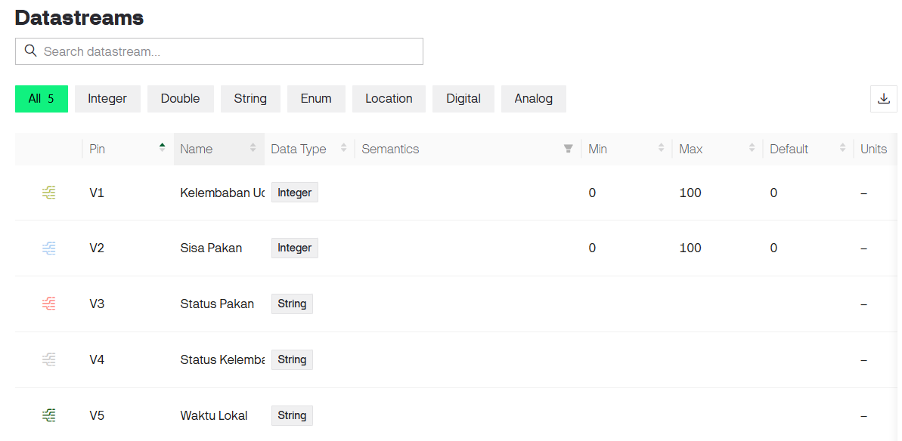
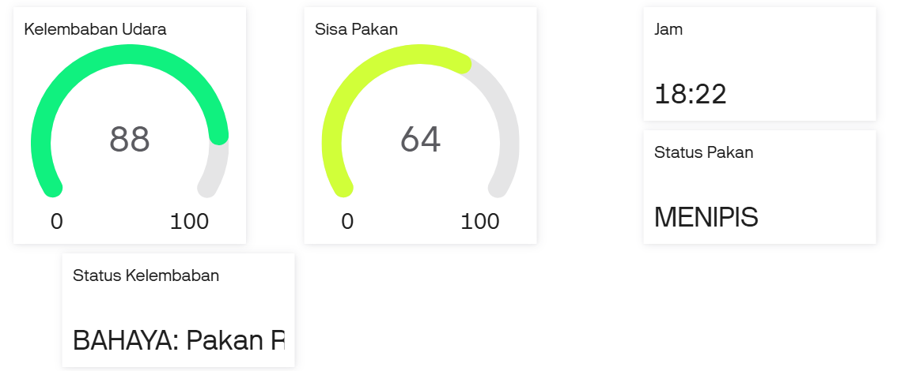

Menginstall library RTC:
- Download folder ZIP ArduinoRTClibrary dan simpan di tempat yang mudah diingat.
- Klik sketch di Arduino IDE
- Klik include library
- Klik add .ZIP library
- masukkan ZIP library RTC yang telah didownload tadi

# Mekanisme Sistem Pakan Ikan Otomatis Berbasis IoT
Sistem pakan ikan otomatis berbasis IoT ini menggunakan NodeMCU ESP8266 sebagai mikrokontroler utama yang terhubung dengan sensor DHT11, sensor ultrasonik HC-SR04, modul RTC DS1302, motor servo, LED indikator, dan platform Blynk untuk monitoring jarak jauh.

Saat sistem dinyalakan, NodeMCU akan terhubung ke jaringan WiFi dan server Blynk. Selanjutnya, waktu dari server NTP disinkronkan dan disimpan pada modul RTC DS1302 sebagai referensi jadwal pemberian pakan.

Setiap 2 detik sistem melakukan pembacaan sensor. Sensor DHT11 digunakan untuk mengukur kelembapan udara di dalam wadah pakan. Data kelembapan digunakan untuk menentukan kondisi pakan, yaitu:

* Aman (< 60%)
* Waspada (60% – 75%)
* Bahaya (> 75%)

Jika kelembapan berada pada kondisi waspada, LED kuning akan menyala. Apabila kelembapan melebihi 75%, LED merah akan menyala sebagai indikator bahwa pakan berisiko rusak akibat kondisi yang terlalu lembap.

Selain itu, sensor ultrasonik HC-SR04 digunakan untuk mengukur jarak antara sensor dan permukaan pakan di dalam wadah. Jarak tersebut kemudian dikonversi menjadi persentase ketersediaan pakan dengan kategori:

* Penuh (100%)
* Menipis (1% – 99%)
* Habis (0%)

Sistem pemberian pakan dilakukan secara otomatis berdasarkan jadwal yang tersimpan pada RTC, yaitu pukul 08.00 WIB dan 17.00 WIB. Ketika waktu pemberian pakan tercapai dan kondisi kelembapan masih aman, motor servo akan membuka katup pakan selama 1 detik untuk mengeluarkan pakan, kemudian kembali menutup katup.

Untuk mencegah pemberian pakan berulang pada waktu yang sama, sistem menggunakan variabel kontrol yang memastikan servo hanya bergerak satu kali pada setiap jadwal pemberian pakan.

Seluruh data hasil pemantauan, seperti kelembapan udara, persentase sisa pakan, status pakan, status kelembapan, dan waktu lokal, dikirim secara real-time ke dashboard Blynk melalui koneksi internet sehingga pengguna dapat memantau kondisi sistem dari mana saja.
